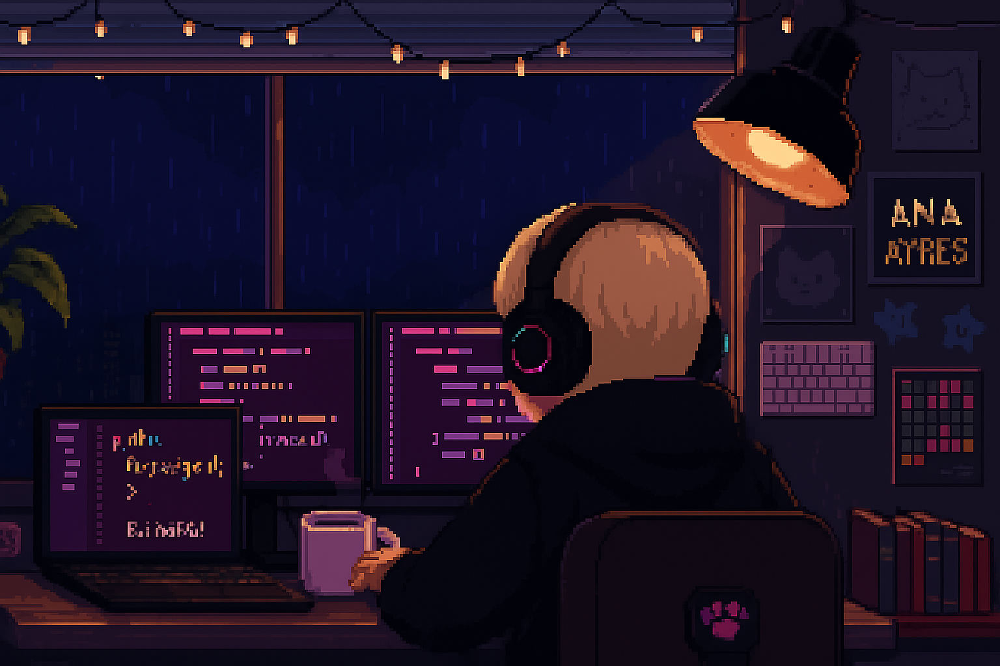

  

#

Estudante de Ciência da Computação que está sempre tentando convencer o próprio código a rodar de primeira (spoiler: raramente acontece ><).

  

### 👩‍💻 Sobre mim

Sou desenvolvedora **Full Stack**. Gosto da lógica pura, de resolver problemas e garantir que tudo esteja funcionando "por baixo do capô". Atualmente, passo meus dias vidrada no terminal, pensando em regras de negócio e tentando fazer o Docker ser meu melhor amigo (mesmo que ele resista)!!!

* 🔭 Atualmente focada em: **VueJs e React**
* ⚙️ Interesses: Sistemas escaláveis, automação e desenvolvimento de APIs
* ⚡ Curiosidade: Eu realmente gosto de debugar! Me sinto em um episódio de Criminal Minds em que o 'descon' sou eu mesma de 2 dias atrás!

#

<h3 align="left">Conecte-se comigo!</h3>

<h3 align="left">My Stack</h3>

  
  
  
  
  
  
  
  
  
  
  
  
  
  
  
  
  
  
  
  
  

 

### 🛠️ O que ando construindo (Projetos Privados)

* **CineTracker API:** Desenvolvida em **NestJS**, focada em boas práticas de DTOs, validações e organização de banco de dados.
* **PokeDuel Simulator:** Aplicação que consome a PokeAPI para buscar dados em tempo real e implementa uma engine de batalha. O foco foi a manipulação de dados externos, tratamento de respostas assíncronas e desenvolvimento da lógica de duelo.

 

  
  

 

  <picture>
    <source media="(prefers-color-scheme: dark)" srcset="https://raw.githubusercontent.com/ayresnator/ayresnator/output/github-contribution-grid-snake-dark.svg">
    <source media="(prefers-color-scheme: light)" srcset="https://raw.githubusercontent.com/ayresnator/ayresnator/output/github-contribution-grid-snake.svg">
    
  </picture>

